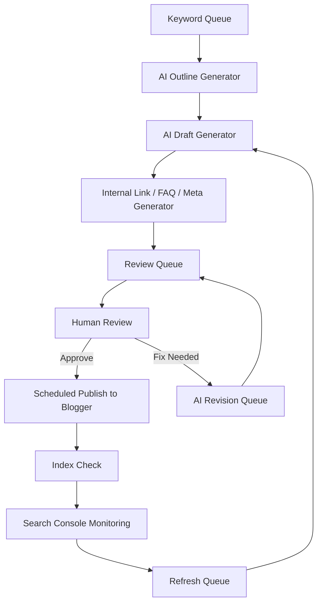
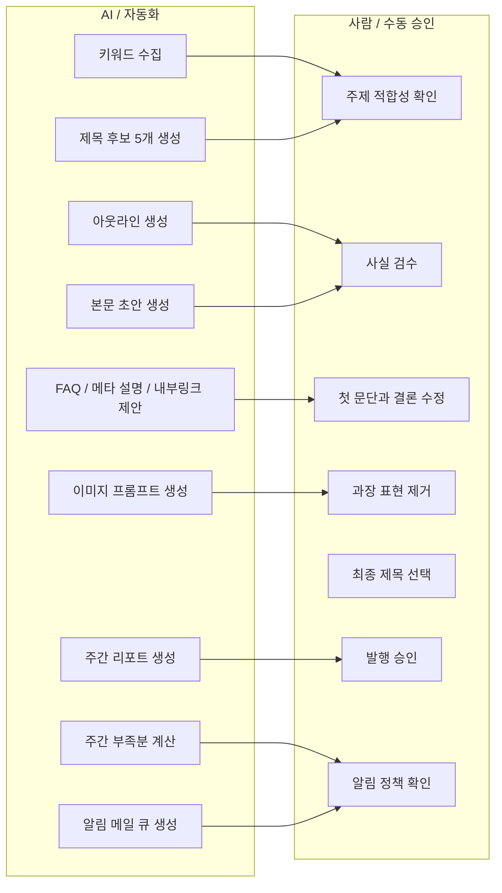

# Blogger Lifehack Automation Plan

## 1. 목표와 전제

- 블로그 플랫폼: `https://mylifehack-daily.blogspot.com/`
- 운영 방식: Blogger에 최종 발행, 외부 자동화 도구가 초안/검수/리포트를 관리
- 승인 목표: 2026-04-08 전후 AdSense 신청 가능 상태 만들기
- 수익 목표: 승인 후 6개월 내 월 50만원
- 작업 제약: 사용자는 주 1~2회 검토만 가능, 글쓰기/이미지 제작은 최대한 자동화
- 원칙: `자동 초안 + 사람 승인 + 예약 발행`, 무인 자동 발행은 하지 않음

## 2. 권장 형태: `.exe`보다 로컬 웹앱 우선

### 결론

1차는 `로컬 웹앱`으로 만들고, 2차로 필요하면 `.exe` 패키징을 추천한다.

### 이유

- Blogger 운영은 작성, 검수, 발행 예약, 리포트 확인이 한 화면에서 이어지는 편이 효율적이다.
- 로컬 웹앱은 구조 변경과 유지보수가 쉽다.
- 같은 기능을 `.exe`로 만들려면 결국 내부는 웹 기술을 감싼 형태가 되는 경우가 많다.
- 향후 Blogger API, Search Console 데이터, Google Sheets 연동을 붙이기 쉽다.
- 운영 상태를 SQLite 단일 파일로 보관하면 백업과 복구가 단순하다.

### 권장 구현 순서

1. `로컬 웹앱` 또는 `localhost 관리자 페이지` 제작
2. SQLite 스키마와 주간 할당량 구조 구현
3. 운영이 안정되면 Electron/Tauri로 `.exe` 포장

## 3. 전체 운영 구조

### 구조 요약

- Blogger: 최종 게시 채널
- 외부 자동화 도구: 키워드 수집, 초안 생성, 내부링크 추천, 발행 대기열 관리
- SQLite: 키워드, 초안, 검수, 발행, 모니터링 상태를 저장하는 운영 DB
- 사람: 사실 검수, 제목 선택, 첫 문단 수정, 최종 승인
- 리포트: Search Console + Blogger 게시 현황 + 수동 체크리스트
- 알림: 주간 목표 미달 및 발행 실패 시 `kimcomplete8888@gmail.com`으로 메일 발송

### 흐름



## 4. AI와 사람의 역할 분리

### 도식화



### 역할 기준

- AI가 해도 되는 것
- 키워드 발굴
- 제목 초안
- 본문 초안
- FAQ
- 내부링크 추천
- 이미지 프롬프트
- 리프레시 후보 선정
- 주간 부족분 집계
- 메일 발송 큐 생성

- 사람이 반드시 해야 하는 것
- 사실관계 확인
- 너무 일반적이거나 뻔한 문장 제거
- 실제 독자에게 유용한지 판단
- 광고 정책 위험 표현 제거
- 최종 발행 승인
- 메일 수신 정책 확인

## 5. Blogger 전용 구조

### 핵심 원칙

Blogger는 폴더 구조가 약하므로 `페이지`, `라벨`, `게시 파이프라인`을 분리해서 관리한다.

### Blogger 내부 구조

#### Pages

- About
- Contact
- Privacy Policy
- Terms of Service
- Start Here

#### Public Labels

- AI-Productivity
- Money-Saving
- Digital-HowTo
- Time-Management
- Home-Organization
- Work-Tips

#### 운영 규칙

- 글 1개당 라벨은 1~2개만 사용
- 승인 전에는 라벨을 과도하게 늘리지 않음
- `Uncategorized` 같은 라벨은 사용하지 않음
- 카테고리 수보다 카테고리당 글 밀도를 우선함

### 외부 관리 구조

운영 상태는 Blogger 안이 아니라 외부 도구나 DB에서 관리한다.

#### 상태값

- `idea`
- `queued`
- `drafted`
- `review`
- `approved`
- `scheduled`
- `published`
- `refresh`

### 주간 할당량 구조

- 매주 `초안 8개`, `검수 6개`, `발행 5~7개`를 DB에 할당량으로 저장
- 각 글은 `assignedWeek`를 가져야 한다
- 실적은 주 단위로 자동 집계한다
- 목표 미달 시 경고와 메일 로그를 생성한다

## 6. 로컬 폴더 구조

자동화 도구와 문서를 아래 구조로 관리한다.

```text
automation/
  config/
  prompts/
  templates/
  data/
    keywords/
    outlines/
    drafts/
    review/
    approved/
    published/
    refresh/
  assets/
    images/
    thumbnails/
  reports/
  logs/
data/
  app.db
  backups/
```

### 파일 규칙

- 키워드 목록: `data/keywords/2026-03-week1.csv`
- 초안: `data/drafts/ai-productivity/how-to-use-free-ai-meeting-notes.md`
- 검수본: `data/review/...`
- 승인본: `data/approved/...`
- 발행 이력: `reports/publish-log.csv`
- 운영 DB: `data/app.db`

## 7. 콘텐츠 전략

### 블로그 포지션

`English lifehack blog for busy workers and households who want to save time and money with free or cheap tools`

### 우선 카테고리

1. AI-Productivity
2. Money-Saving
3. Digital-HowTo
4. Time-Management
5. Home-Organization
6. Work-Tips

### 승인 전 피해야 할 것

- 투자, 대출, 세금, 의료, 법률 중심 글
- 상품 리뷰만 있는 얇은 글
- AI가 뽑은 일반론 나열형 글
- 동일 구조 반복이 심한 대량 게시

## 8. 주별 최소 생산량

### 승인 전 4주 기준 최소치

AdSense 승인 시도 전까지 `최소 24개 게시글 + 필수 페이지 5개`를 목표로 한다.

### 주별 기준

#### Week 1

- 필수 페이지 5개 완성
- 글 초안 8개 생성
- 최종 발행 5개

#### Week 2

- 글 초안 8개 생성
- 최종 발행 6개

#### Week 3

- 글 초안 8개 생성
- 최종 발행 6개

#### Week 4

- 글 초안 8개 생성
- 최종 발행 7개
- 내부링크 보강
- 인덱싱 상태 확인 후 신청 준비

### 최소 운영선

승인 목표를 지키려면 매주 최소 아래 숫자는 필요하다.

- 초안 생성: 주 8개
- 사람 검수 통과: 주 6개
- 최종 발행: 주 5~7개

이 기준 아래로 내려가면 1개월 승인 일정은 바로 밀린다.

## 9. 모니터링 체계

### 생산 모니터링

매주 아래 항목을 본다.

- 이번 주 신규 키워드 수
- 이번 주 초안 생성 수
- 이번 주 검수 대기 수
- 이번 주 승인 수
- 이번 주 발행 수
- 카테고리별 발행 비중
- 마지막 메일 알림 발송 상태

### 경고 기준

- 수요일까지 초안 4개 미만: `노랑`
- 금요일까지 승인 3개 미만: `빨강`
- 일요일까지 발행 5개 미만: `빨강`
- 특정 카테고리 비중이 50% 초과: `노랑`
- 2주 연속 같은 템플릿 구조 반복: `빨강`

### 알림 정책

- 수요일 18:00: 초안 부족 메일 발송
- 금요일 18:00: 검수 부족 메일 발송
- 일요일 21:00: 발행 부족 메일 발송
- 발행 실패 즉시: 실패 메일 발송
- 수신 주소: `kimcomplete8888@gmail.com`
- 발송 경로: SMTP
- 실행 API: `POST /api/quotas/evaluate`, `POST /api/notifications/process`

### 품질 모니터링

- 평균 본문 길이 1,000단어 미만
- 내부링크 2개 미만
- FAQ 없음
- 실질 예시 없음
- AI 문체 흔적 과다

위 항목 중 2개 이상이면 재작성 대기열로 이동한다.

### 검색 모니터링

- 게시 후 7일 내 색인 여부
- 14일 내 impressions 발생 여부
- 30일 내 클릭 0인 글 목록
- CTR 낮은 글 제목 교체 후보

## 10. 리포트 대시보드 항목

외부 시트 또는 웹앱 첫 화면에는 아래 지표가 필요하다.

- 이번 주 목표 발행 수
- 현재 발행 수
- 승인 대기 글 수
- 예약 발행 글 수
- 미색인 글 수
- 14일 이상 무노출 글 수
- 리프레시 필요 글 수
- 마지막 알림 메일 성공 여부

### 권장 상태 색상

- 초록: 목표 달성
- 노랑: 주간 목표 대비 80% 미만
- 빨강: 주간 목표 대비 60% 미만

## 11. 게시 템플릿 표준

각 글은 아래 구조를 고정한다.

1. Problem-focused intro
2. Quick answer summary
3. Step-by-step guide
4. Real-life use case
5. Cost/time saving angle
6. FAQ
7. Related posts

### 최소 기준

- 제목: 검색형 제목
- 본문: 1,000~1,600단어
- 이미지: 1~2개
- FAQ: 3개 이상
- 내부링크: 2~4개
- 외부 신뢰 출처: 필요 시 1~2개

## 12. 초기 4주 운영 캘린더

### 월요일

- 키워드 큐 정리
- AI 초안 생성 시작

### 화요일

- 초안 4개 완성
- 이미지 프롬프트 생성

### 수요일

- 초안 4개 추가 완성
- 내부링크 추천 반영
- 초안 부족 여부 계산 후 경고 메일 발송

### 목요일

- 사람 검수 1차
- 승인/반려 분류

### 금요일

- 사람 검수 2차
- 예약 발행 등록
- 승인 부족 여부 계산 후 경고 메일 발송

### 토요일

- 2~3개 게시

### 일요일

- 2~4개 게시
- 주간 리포트 생성
- 발행 부족 여부 계산 후 경고 메일 발송

## 13. 자동화 범위 우선순위

### 1차 필수

- 키워드 큐 생성
- 제목/아웃라인 생성
- 본문 초안 생성
- FAQ/메타 설명 생성
- 발행 대기열 관리
- 주간 리포트
- 주간 할당량 계산
- 경고 메일 큐 생성

### 2차 권장

- Blogger 예약 발행 보조
- Search Console 데이터 연동
- 저성과 글 리프레시 추천
- 메일 자동 발송
- 메일 발송 성공/실패 재처리

### 3차 선택

- 이미지 자동 생성
- `.exe` 배포
- 반자동 리라이트

## 14. 실행 판단 기준

아래 조건을 만족하면 AdSense 신청을 진행한다.

- 게시글 24개 이상
- 필수 페이지 5개 완료
- 3개 이상 카테고리에 글 분산
- 미완성 글/빈 카테고리 없음
- Search Console에서 주요 URL 색인 확인
- 최근 7일 내 신규 게시 지속

## 15. 다음 구현 우선순위

1. `plan.md` 기준 운영 확정
2. 키워드/초안/검수 상태를 관리할 로컬 웹앱 설계
3. SQLite 스키마와 주간 할당량 구조 구현
4. 주간 대시보드, 경고 로직, 이메일 알림 구현
5. Blogger 발행용 템플릿 확정
6. 필요 시 `.exe` 포장

## 16. 실제 메일 발송 준비

- `.env.local`에 SMTP 정보를 입력해야 실제 메일이 발송된다.
- 값이 없으면 알림 로그는 `SKIPPED`로 기록된다.
- 운영자는 주 1회 이상 Notification Center에서 실패 로그를 확인한다.
- 현재 구현 검증 결과: 할당량 평가 후 알림 3건이 생성되었고, SMTP 미설정 상태에서 3건 모두 `SKIPPED` 처리됨
